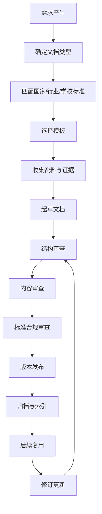

把 `02_文档管理与书写规范.md` 这个 skill，从“个人经验型文档规范”升级为“以国家标准、行业标准、软件工程标准、学术写作标准为基线的工业级文档管理 Skill”。**

你现在的 `02` 文件已经有基础框架：文档原则、图表规范、软件生命周期文档、模板、版本控制等，但它还停留在“个人/团队规范”层面，缺少**权威标准索引、标准适用边界、文档分级体系、验收规则、模板库、审查机制、Agent 调研机制**。

---

# 一、这个 Skill 应该升级成什么

建议把 `02_文档管理与书写规范.md` 重构为：

> **02_国家标准驱动的文档管理与工程化写作规范 Skill**

它的定位不是“怎么写 Markdown”，而是：

> 为个人项目、课程作业、毕业设计、软件工程项目、论文报告、技术文档、产品文档建立一套**可引用、可追溯、可审查、可复用、可交付**的文档生产标准。

---

# 二、核心重构方向

你现在的 Skill 可以保留，但要重构为 8 个模块。

## 1. 标准索引层

建立一个“国家标准 / 行业标准 / 国际标准 / 高校规范 / 企业规范”的索引库。

重点标准至少包括：

|类型|标准/规范|用途|
|---|---|---|
|学位论文|GB/T 7713.1—2025《信息与文献 编写规则 第1部分：学位论文》|毕设、论文、正式报告结构基线|
|学术论文|GB/T 7713.2—2022《学术论文编写规则》|学术论文、课程论文、调研报告|
|参考文献|GB/T 7714—2015《信息与文献 参考文献著录规则》|引用、参考文献格式|
|软件文档|GB/T 8567—2006《计算机软件文档编制规范》|软件工程项目文档总基线|
|需求规格|GB/T 9385—2008《计算机软件需求规格说明规范》|SRS 需求规格说明书|
|标点|GB/T 15834—2011《标点符号用法》|中文正式文档基础规范|
|量和单位|GB/T 3100、GB/T 3101、GB/T 3102|数值、单位、公式、实验数据|
|标准编写|GB/T 1.1—2020|标准化文件结构与表述方式|
|国际软件工程|ISO/IEC/IEEE 12207、29148、15288 等|软件生命周期、需求工程补充参考|

其中，GB/T 7713.1—2025 已由全国标准信息公共服务平台列为现行标准，发布日期为 2025-08-01，实施日期为 2026-02-01，并全部代替 GB/T 7713.1—2006。([全国标准信息公共服务平台](https://std.samr.gov.cn/gb/search/gbDetailed?id=3B46A026CC84469CE06397BE0A0AEEB8&utm_source=chatgpt.com "学位论文 - 全国标准信息公共服务平台"))  
GB/T 8567—2006《计算机软件文档编制规范》当前状态为现行，适用于计算机软件文档编制。([国家标准公开信息平台](https://openstd.samr.gov.cn/bzgk/std/newGbInfo?hcno=84C42B6277D2714B7176B10C6E6B1A44&utm_source=chatgpt.com "GB/T 8567-2006 - 国家标准全文公开"))  
GB/T 9385—2008《计算机软件需求规格说明规范》当前状态为现行，并在 2022-01-10 复审后继续有效。([国家标准公开信息平台](https://openstd.samr.gov.cn/bzgk/std/newGbInfo?hcno=2790825C43AD0B69E3C38C140BFFCFE6&utm_source=chatgpt.com "GB/T 9385-2008 - 国家标准全文公开"))  
GB/T 7714—2015《信息与文献 参考文献著录规则》当前状态为现行，发布日期为 2015-05-15，实施日期为 2015-12-01。([国家标准公开信息平台](https://openstd.samr.gov.cn/bzgk/std/newGbInfo?hcno=7FA63E9BBA56E60471AEDAEBDE44B14C&utm_source=chatgpt.com "标准号：GB/T 7714-2015 采 - 国家标准全文公开"))

---

## 2. 文档分类层

你现在的分类太粗，建议升级为：

| 一级分类   | 二级文档                                          |
| ------ | --------------------------------------------- |
| 学术文档   | 课程论文、实验报告、调研报告、开题报告、毕业论文、文献综述                 |
| 软件工程文档 | 可行性分析、SRS、概要设计、详细设计、数据库设计、接口文档、测试文档、部署文档、用户手册 |
| 产品文档   | PRD、MRD、BRD、用户故事、竞品分析、路线图                     |
| 项目管理文档 | 项目章程、WBS、进度计划、风险表、会议纪要、复盘报告                   |
| 技术知识文档 | 技术方案、源码阅读、框架学习、故障排查、SOP                       |
| 交付型文档  | 答辩 PPT、验收报告、用户指南、演示脚本、归档清单                    |

---

## 3. 标准映射层

每一种文档都要绑定标准。

示例：

| 文档类型      | 主标准                | 辅助标准                           | 输出格式             |
| --------- | ------------------ | ------------------------------ | ---------------- |
| 毕业论文      | GB/T 7713.1—2025   | GB/T 7714—2015、GB/T 15834—2011 | LaTeX / Word     |
| 学术论文      | GB/T 7713.2—2022   | GB/T 7714—2015                 | LaTeX / Word     |
| 软件需求规格说明书 | GB/T 9385—2008     | GB/T 8567—2006                 | Markdown / LaTeX |
| 软件工程文档集   | GB/T 8567—2006     | ISO/IEC/IEEE 12207             | Markdown / Docx  |
| 项目计划      | PMBOK / ISO 项目管理规范 | 团队 SOP                         | Markdown / Excel |
| API 文档    | OpenAPI / Swagger  | RESTful 设计规范                   | YAML / Markdown  |

---

## 4. 文档质量验收层

每份文档都必须有检查项：

```markdown
## 文档验收清单

### A. 结构完整性
- [ ] 是否有标题、版本号、作者、日期
- [ ] 是否有目录或章节结构
- [ ] 是否有变更记录
- [ ] 是否有参考资料或证据来源

### B. 内容完整性
- [ ] 是否回答“为什么、是什么、怎么做、怎么验证”
- [ ] 是否有输入、处理、输出
- [ ] 是否有边界条件
- [ ] 是否有异常情况
- [ ] 是否有验收标准

### C. 标准符合性
- [ ] 是否符合对应国家标准
- [ ] 是否符合学校/课程模板
- [ ] 是否符合软件工程文档规范
- [ ] 图表编号是否规范
- [ ] 引用格式是否规范

### D. 可执行性
- [ ] 是否能指导下一步行动
- [ ] 是否能被他人复现
- [ ] 是否能作为开发、测试、答辩或验收依据

### E. 可维护性
- [ ] 是否支持版本控制
- [ ] 是否有命名规范
- [ ] 是否有归档路径
- [ ] 是否能被检索
```

---

## 5. 文档生命周期层

你现在有项目生命周期，但需要转成“文档生命周期”。



---

## 6. 目录结构层

建议把 Skill 变成一个文件夹，而不是一个单文件。

```text
02_文档管理与书写规范/
├── README.md
├── 00_skill说明.md
├── 01_国家标准索引.md
├── 02_文档分类体系.md
├── 03_学术文档规范.md
├── 04_软件工程文档规范.md
├── 05_产品与项目管理文档规范.md
├── 06_图表与UML规范.md
├── 07_引用与参考文献规范.md
├── 08_文档命名与版本控制.md
├── 09_文档质量审查清单.md
├── 10_Agent调研任务库.md
├── templates/
│   ├── 学位论文模板.md
│   ├── 文献综述模板.md
│   ├── 开题报告模板.md
│   ├── 需求规格说明书模板.md
│   ├── 概要设计说明书模板.md
│   ├── 详细设计说明书模板.md
│   ├── 数据库设计说明书模板.md
│   ├── 测试计划模板.md
│   ├── 测试报告模板.md
│   ├── 用户手册模板.md
│   └── 项目复盘模板.md
├── checklists/
│   ├── 毕业论文检查清单.md
│   ├── SRS检查清单.md
│   ├── 软件设计文档检查清单.md
│   ├── 测试文档检查清单.md
│   └── 引用格式检查清单.md
└── references/
    ├── 国家标准索引表.csv
    ├── 行业标准索引表.csv
    ├── 高校论文规范索引表.csv
    └── 国际标准索引表.csv
```

---

# 三、给 Agent 的总控提示词

下面这个是主 Agent 提示词，负责统筹所有子任务。

```text
你是“文档管理 Skill 工业级重构总控 Agent”。

目标：
对现有的《02_文档管理与书写规范.md》进行工业级重构，使其从个人经验型文档规范升级为“国家标准、行业标准、软件工程标准、学术写作标准驱动的文档管理 Skill”。

当前 Skill 已包含：
1. 文档编写原则
2. 文档类型与格式
3. 图表绘制规范
4. Mermaid / PlantUML 示例
5. 软件生命周期文档体系
6. 项目生命周期流程图
7. 需求文档模板
8. 技术设计文档模板
9. 会议纪要模板
10. 文档版本控制

但当前问题是：
1. 缺少国家标准索引
2. 缺少标准适用范围说明
3. 缺少文档类型与标准之间的映射
4. 缺少工业级文档生命周期
5. 缺少文档质量验收机制
6. 缺少学术文档、软件工程文档、项目管理文档、产品文档的分层规范
7. 模板偏少，无法支撑毕业设计、课程项目、软件项目、团队协作等复杂场景
8. 缺少 Agent 调研机制和资料更新机制
9. 缺少引用、证据链、版本归档和审查规则

你的任务：
将该 Skill 重构为一个可长期维护的文件夹型知识技能模块。

输出内容必须包括：

1. 重构后的 Skill 总目录
2. 每个文件的职责说明
3. 国家标准索引体系
4. 文档分类体系
5. 文档类型与标准映射表
6. 软件工程文档体系
7. 学术论文/毕业设计文档体系
8. 项目管理文档体系
9. 产品需求文档体系
10. 图表规范体系
11. 引用与参考文献规范体系
12. 文档命名、版本控制、归档规范
13. 文档质量检查清单
14. Agent 调研任务拆分
15. 后续维护机制

要求：
- 所有国家标准必须核验标准号、名称、发布日期、实施日期、当前状态、适用范围。
- 所有规范必须区分“国家标准”“行业标准”“国际标准”“高校规范”“企业实践”“个人建议”。
- 不得编造标准。
- 对无法确认现行状态的标准必须标记“待核验”。
- 输出要能直接指导我修改 `02_文档管理与书写规范.md`。
```

---

# 四、子 Agent 任务拆分

## Agent 1：国家标准索引 Agent

```text
你是“国家标准索引 Agent”。

任务：
为《02_文档管理与书写规范》建立国家标准索引库。

重点检索以下方向：

1. 学位论文与学术论文写作标准
2. 参考文献著录标准
3. 标点符号标准
4. 数字、量、单位、公式表达标准
5. 软件工程文档标准
6. 软件需求规格说明标准
7. 软件测试文档标准
8. 信息系统、数据管理、网络安全相关文档标准
9. 标准化文件编写规则
10. 档案管理、电子文件归档相关标准

必须优先检索：
- 全国标准信息公共服务平台
- 国家标准全文公开系统
- 国家标准委相关页面
- 教育部、工信部等官方来源

输出表格字段：

| 标准编号 | 标准名称 | 标准类型 | 发布日期 | 实施日期 | 当前状态 | 替代关系 | 主管部门 | 归口单位 | 适用范围 | 对 Skill 的用途 | 是否必须纳入 | 证据链接 | 备注 |

要求：
1. 不得只列标准名，必须核验现行状态。
2. 对涉及版权无法在线预览的标准，要标记“可索引但不可全文摘录”。
3. 对已废止标准，要说明被哪个标准替代。
4. 输出“必须纳入 Skill 的标准清单”和“可选参考标准清单”。
```

---

## Agent 2：软件工程文档标准 Agent

```text
你是“软件工程文档标准 Agent”。

任务：
围绕软件工程项目文档，调研国家标准、国际标准和工程实践，建立软件项目文档基线。

重点标准：
1. GB/T 8567—2006《计算机软件文档编制规范》
2. GB/T 9385—2008《计算机软件需求规格说明规范》
3. 软件测试相关国家标准
4. 软件质量模型相关标准
5. ISO/IEC/IEEE 12207 软件生命周期过程
6. ISO/IEC/IEEE 29148 需求工程
7. IEEE 830 软件需求规格说明历史规范
8. IEEE 1016 软件设计描述
9. IEEE 829 软件测试文档历史规范

输出：

1. 软件工程文档全景图
2. 各阶段应产出的文档
3. 每类文档的目的、读者、输入、输出
4. 每类文档的推荐模板
5. 每类文档的检查清单
6. 国家标准与国际标准的映射关系
7. 本科软件工程项目推荐采用的轻量化版本
8. 企业级项目推荐采用的完整版本

特别要求：
区分“适合课程项目/毕设的轻量文档”和“适合企业项目的完整文档”，避免把 Skill 做得过重。
```

---

## Agent 3：学术写作与毕业论文规范 Agent

```text
你是“学术写作与毕业论文规范 Agent”。

任务：
为 Skill 建立学术文档写作规范，重点覆盖课程论文、实验报告、文献综述、开题报告、毕业论文、调研报告。

重点标准：
1. GB/T 7713.1—2025《信息与文献 编写规则 第1部分：学位论文》
2. GB/T 7713.2—2022《学术论文编写规则》
3. GB/T 7714—2015《信息与文献 参考文献著录规则》
4. GB/T 15834—2011《标点符号用法》
5. 量和单位相关国家标准
6. 高校本科毕业设计论文规范示例

输出：

1. 学术文档分类体系
2. 学位论文标准结构
3. 学术论文标准结构
4. 文献综述结构
5. 开题报告结构
6. 实验报告结构
7. 调研报告结构
8. 摘要、关键词、目录、图表、公式、参考文献、附录规范
9. 引用格式规范
10. 常见格式错误清单
11. 老师最容易批评的问题清单
12. 可直接放入 Skill 的模板

要求：
不要只讲写作技巧，必须转化为可执行的文档规范、模板和检查清单。
```

---

## Agent 4：文档分类与生命周期 Agent

```text
你是“文档分类与生命周期 Agent”。

任务：
对 Skill 中的文档体系进行重新分类和生命周期设计。

请建立以下体系：

1. 文档分类体系
- 学术文档
- 软件工程文档
- 产品文档
- 项目管理文档
- 技术知识文档
- 交付验收文档
- 会议协作文档
- 运维与部署文档

2. 文档生命周期
- 需求产生
- 文档立项
- 标准匹配
- 模板选择
- 资料收集
- 初稿撰写
- 内部审查
- 标准合规审查
- 发布
- 归档
- 复用
- 修订
- 废弃

3. 文档状态机
- draft
- review
- approved
- archived
- deprecated

4. 文档元数据规范
- 标题
- 类型
- 作者
- 审核人
- 创建日期
- 更新日期
- 版本号
- 状态
- 适用范围
- 关联项目
- 参考标准
- 关联文档
- 存储路径
- 标签

输出：
1. 新文档分类表
2. 文档生命周期流程图 Mermaid
3. 文档状态机图 Mermaid
4. 文档元数据模板
5. 文档归档规则
6. 文档废弃规则
```

---

## Agent 5：模板库 Agent

```text
你是“文档模板库 Agent”。

任务：
为 Skill 设计一套工业级模板库。

至少输出以下模板：

学术类：
1. 课程论文模板
2. 文献综述模板
3. 开题报告模板
4. 毕业论文结构模板
5. 实验报告模板
6. 调研报告模板

软件工程类：
1. 可行性分析报告模板
2. 软件需求规格说明书 SRS 模板
3. 概要设计说明书模板
4. 详细设计说明书模板
5. 数据库设计说明书模板
6. API 接口文档模板
7. 测试计划模板
8. 测试用例模板
9. 测试报告模板
10. 部署说明模板
11. 用户手册模板
12. 运维手册模板

产品与项目管理类：
1. PRD 模板
2. MRD 模板
3. 竞品分析模板
4. 项目计划模板
5. 风险管理表模板
6. 会议纪要模板
7. 项目复盘模板

每个模板必须包含：
- 文档目的
- 适用场景
- 目标读者
- 参考标准
- 文档结构
- 填写说明
- 检查清单
- 常见错误
- Markdown 模板正文

要求：
模板要“可直接复制使用”，不是只列目录。
```

---

## Agent 6：引用与证据链 Agent

```text
你是“引用与证据链 Agent”。

任务：
为 Skill 建立资料引用、证据链和参考文献管理规范。

重点解决：
1. 如何记录资料来源
2. 如何区分权威来源和普通来源
3. 如何判断资料是否可引用
4. 如何管理网页、论文、标准、政策、书籍、开源项目、产品文档
5. 如何把资料转化为论文参考文献
6. 如何避免 AI 编造引用
7. 如何建立“结论—证据—引用”链路

输出：

1. 资料来源分级制度
2. 资料元数据表
3. 证据链记录模板
4. 参考文献管理规则
5. GB/T 7714—2015 常见类型著录示例
6. 网页引用规则
7. 标准引用规则
8. 开源项目引用规则
9. AI 辅助写作记录规则
10. 不可引用资料清单
11. 引用审查清单

要求：
特别强调：没有来源的内容不得进入正式文档；AI 生成内容不能作为事实来源。
```

---

## Agent 7：图表与建模规范 Agent

```text
你是“图表与建模规范 Agent”。

任务：
升级 Skill 中的图表绘制规范。

当前 Skill 已包含 Mermaid 和 PlantUML 示例，但缺少图表选择规则、命名规则、编号规则、审查规则和软件工程建模规范。

请输出：

1. 图表类型分类
- 流程图
- 活动图
- 状态图
- 时序图
- 用例图
- 类图
- 组件图
- 部署图
- E-R 图
- 数据流图
- 架构图
- 甘特图
- 思维导图
- UI 流程图
- 原型图
- 数据可视化图

2. 每种图适用场景
3. 每种图不适用场景
4. 推荐工具
5. Mermaid / PlantUML 示例
6. 图题、编号、引用规则
7. 图表进入论文正文的规范
8. 图表进入工程文档的规范
9. 常见错误
10. 图表审查清单

要求：
重点服务软件工程、毕业设计、项目文档，而不是泛泛讲画图。
```

---

## Agent 8：文档质量审查 Agent

```text
你是“文档质量审查 Agent”。

任务：
设计一套用于审查所有文档质量的标准化机制。

请输出：

1. 文档质量评分模型
2. 评分维度
- 结构完整性
- 内容准确性
- 逻辑连贯性
- 标准符合性
- 证据充分性
- 可执行性
- 可维护性
- 可读性
- 版本可追踪性

3. 每个维度的评分规则
4. 一票否决项
5. 常见问题库
6. 自动审查 Prompt
7. 人工审查表
8. 文档发布前检查清单
9. 文档归档前检查清单
10. 文档复用前检查清单

特别要求：
输出结果要能直接成为 Skill 中的 `09_文档质量审查清单.md`。
```

---

## Agent 9：Skill 重构执行 Agent

```text
你是“Skill 重构执行 Agent”。

任务：
根据其他 Agent 的调研结果，重写 `02_文档管理与书写规范.md`，并将其拆分为文件夹型 Skill。

请输出：

1. 新版 Skill 的 README.md
2. 新版主文档目录
3. 每个子文档的正文草稿
4. templates 文件夹模板
5. checklists 文件夹清单
6. references 文件夹索引表结构
7. 旧版内容如何迁移
8. 哪些旧内容保留
9. 哪些旧内容删除
10. 哪些旧内容升级
11. 后续维护规范

要求：
1. 保留旧版中有价值的部分，例如：
   - 单一职责
   - 读者优先
   - 可执行性
   - 版本控制
   - 链接优先
   - Mermaid / PlantUML 示例
   - 软件生命周期文档体系
   - 文档模板

2. 删除或改写过于简单、缺少标准依据、无法验收的内容。

3. 新版 Skill 必须从“经验总结”升级为“标准驱动 + 模板驱动 + 检查清单驱动 + Agent 可维护”的工业级文档规范。
```

---

# 五、推荐你最终改成的 Skill 顶层结构

```markdown
# 02_国家标准驱动的文档管理与工程化写作规范

## 1. Skill 定位

本 Skill 用于建立个人、团队、课程项目、毕业设计、软件工程项目中的文档管理、写作、审查、归档和复用规范。

本 Skill 的目标不是简单规定“文档怎么写”，而是建立一套标准驱动的文档生产体系，使文档具备：

- 可溯源
- 可审查
- 可复用
- 可维护
- 可交付
- 可归档
- 可被他人接手

## 2. 适用范围

- 课程作业
- 实验报告
- 调研报告
- 文献综述
- 开题报告
- 毕业设计论文
- 软件工程项目
- 产品需求文档
- 技术设计文档
- 项目管理文档
- 团队协作文档
- 个人知识库文档

## 3. 标准体系

本 Skill 参考以下标准体系：

| 层级 | 内容 |
|---|---|
| 国家标准 | 学位论文、参考文献、软件文档、需求规格、标点符号、量和单位 |
| 行业标准 | 软件工程、信息系统、测试、运维、安全 |
| 国际标准 | ISO/IEC/IEEE 软件生命周期、需求工程、系统工程 |
| 高校规范 | 本科毕业设计、课程论文、实验报告规范 |
| 企业实践 | PRD、技术方案、API 文档、项目管理文档 |
| 个人规范 | 文件命名、版本控制、知识库链接、复盘机制 |

## 4. 核心原则

1. 标准优先
2. 读者优先
3. 单一职责
4. 证据可追溯
5. 模板化生产
6. 检查清单验收
7. 版本可维护
8. 链接优先
9. 归档优先
10. 可复用优先
```

---

# 六、你这次真正要让 Agent 产出的不是“资料”，而是这些资产

最终交付物应该是：

```text
1. 国家标准索引表
2. 软件工程文档标准索引表
3. 学术文档标准索引表
4. 文档类型—标准映射表
5. 文档分类体系
6. 文档生命周期模型
7. 文档状态机
8. 文档元数据模板
9. 文档命名规范
10. 文档版本控制规范
11. 文档归档规范
12. 软件工程文档模板库
13. 学术文档模板库
14. 项目管理文档模板库
15. 图表绘制规范
16. 引用与证据链规范
17. 文档质量评分表
18. 文档发布检查清单
19. Agent 调研任务库
20. Skill 维护说明
```

---

# 七、最重要的执行原则

你这次不要让 Agent “写一篇很长的文档”。  
你要让 Agent **分工生产标准资产**。

最合理的执行顺序是：

```text
第 1 批：
Agent 1：国家标准索引
Agent 2：软件工程文档标准
Agent 3：学术写作规范

第 2 批：
Agent 4：文档分类与生命周期
Agent 6：引用与证据链
Agent 7：图表与建模规范

第 3 批：
Agent 5：模板库
Agent 8：文档质量审查

第 4 批：
Agent 9：整合重构 Skill
```

---

# 八、最后给你一个最短总命令

你可以直接把这一段丢给总控 Agent：

```text
我要重构 `02_文档管理与书写规范.md`，目标是将其从个人经验型文档规范升级为“国家标准驱动、软件工程标准驱动、学术写作标准驱动、模板库驱动、检查清单驱动、Agent 可持续维护”的工业级文档管理 Skill。

请不要围绕某个具体毕业设计选题展开，而是只服务于这个 Skill 的强化。

请完成以下工作：
1. 建立国家标准与行业标准索引；
2. 建立文档分类体系；
3. 建立文档类型与标准映射表；
4. 建立软件工程文档体系；
5. 建立学术文档体系；
6. 建立产品与项目管理文档体系；
7. 建立引用与证据链规范；
8. 建立图表与建模规范；
9. 建立模板库；
10. 建立检查清单；
11. 建立文档生命周期和版本控制规范；
12. 将现有 `02_文档管理与书写规范.md` 拆分并重构为文件夹型 Skill。

所有标准必须核验标准号、标准名称、发布日期、实施日期、当前状态、适用范围和来源链接。不得编造标准。无法确认的信息必须标记为“待核验”。最终输出必须能直接用于修改和扩展 `02` Skill。
```

这次的关键判断是：**你不是在补充一个文档，而是在建设一个“文档生产系统”。**  
`02` 的升级目标应该是：以后你所有课程作业、毕设、项目文档、技术方案、团队协作规范，都能从这里取标准、取模板、取检查清单。
