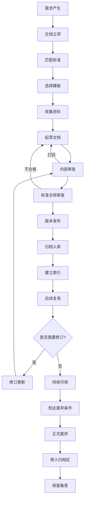
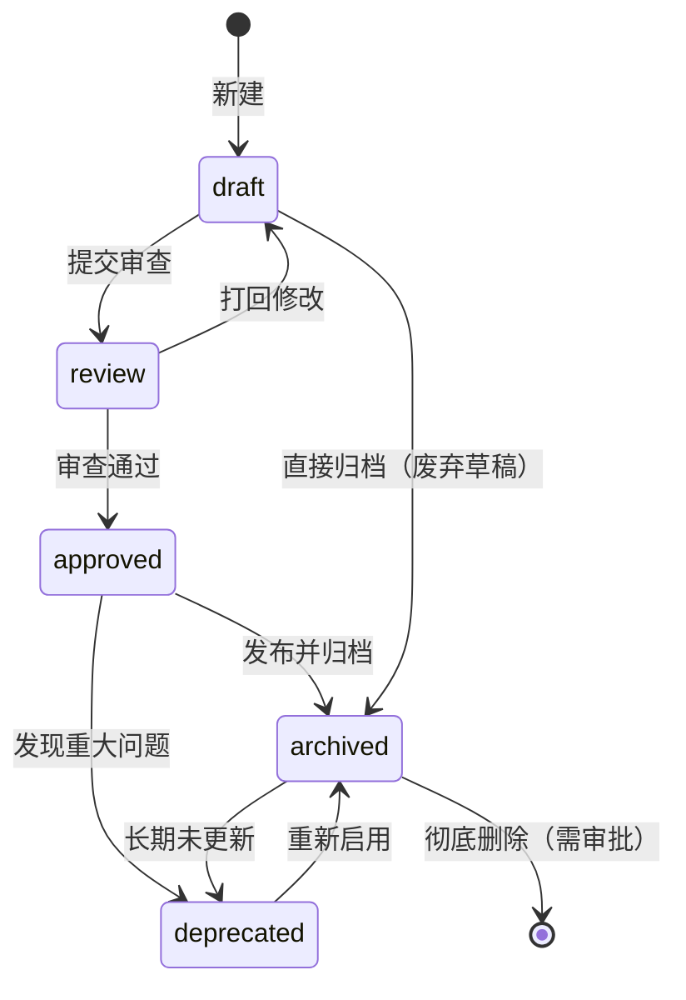

# 文档分类与生命周期

> 本模块建立完整的文档分类体系、文档生命周期、状态机、元数据规范、命名规范和版本控制规范。

---

## 一、文档分类体系

### 一级分类与二级分类

| 一级分类 | 二级分类 | 说明 |
|---|---|---|
| **学术文档** | 课程论文、实验报告、文献综述、开题报告、毕业论文、调研报告 | 依据 GB/T 7713 系列和高校规范 |
| **软件工程文档** | 可行性分析、SRS、概要设计、详细设计、数据库设计、接口文档、测试文档、部署文档、用户手册、运维手册 | 依据 GB/T 8567—2006、GB/T 9385—2008 |
| **产品文档** | PRD、MRD、BRD、用户故事、竞品分析、产品路线图 | 面向产品全生命周期 |
| **项目管理文档** | 项目章程、WBS、进度计划、风险表、会议纪要、复盘报告 | 面向项目全生命周期 |
| **技术知识文档** | 技术方案、源码分析、框架学习、故障排查、SOP | 面向个人/团队知识积累 |
| **交付验收文档** | 答辩PPT、验收报告、用户指南、演示脚本、归档清单 | 面向交付和验收环节 |
| **会议协作文档** | 会议纪要、决策记录、头脑风暴记录、评审记录 | 面向团队协作过程 |
| **运维与部署文档** | 部署手册、运维手册、故障响应流程、环境配置说明 | 面向系统运维 |

---

## 二、文档生命周期

### 2.1 文档生命周期流程



### 2.2 生命周期各阶段说明

| 阶段 | 输入 | 活动 | 输出 | 负责人 |
|---|---|---|---|---|
| 需求产生 | 业务需求/技术需求 | 识别需要产出的文档类型 | 文档需求说明 | 发起人 |
| 文档立项 | 文档需求说明 | 确定编写计划、分配责任人 | 文档编写任务 | 项目经理/作者 |
| 匹配标准 | 文档类型 | 确定适用的国家/行业标准 | 标准匹配表 | 作者 |
| 选择模板 | 标准匹配结果 | 选择或定制模板 | 基于模板的空白文档 | 作者 |
| 收集资料 | 空白文档 | 收集数据、文献、代码等素材 | 资料汇编 | 作者 |
| 起草文档 | 资料汇编 | 按模板结构撰写内容 | 文档初稿 | 作者 |
| 内部审查 | 文档初稿 | 同行评审、内容核对 | 审查意见 | 评审人 |
| 标准合规审查 | 审查后文档 | 检查是否符合标准规范 | 合规报告 | 质量负责人 |
| 版本发布 | 合规文档 | 分配正式版本号、发布 | 正式版文档 | 作者/发布人 |
| 归档入库 | 正式版文档 | 存入指定归档路径 | 归档确认 | 文档管理员 |
| 建立索引 | 归档文档 | 录入索引系统、建立关联 | 索引记录 | 文档管理员 |
| 后续复用 | 索引记录 | 查找、引用、基于已有文档创作 | 引用记录 | 复用者 |
| 修订更新 | 变更请求 | 评估变更、执行修订 | 新版文档 | 原作者/继任者 |
| 正式废弃 | 废弃申请 | 确认无复用价值、正式标记 | 废弃记录 | 文档管理员 |

---

## 三、文档状态机



### 状态定义

| 状态 | 含义 | 可执行的操作 |
|---|---|---|
| `draft` | 草稿，正在编写中 | 编辑、提交审查、删除 |
| `review` | 审查中，等待评审 | 评审、通过、驳回 |
| `approved` | 已通过审查，待发布 | 发布、归档 |
| `archived` | 已归档，正式版本 | 引用、申请废弃、申请更新 |
| `deprecated` | 已废弃，不再使用 | 重新启用、彻底删除 |

---

## 四、文档元数据规范

每份正式文档必须包含以下元数据头：

```markdown
---
title: [文档标题]
type: [文档类型 如 SRS/论文/会议纪要]
author: [作者姓名]
reviewer: [审核人姓名]
created_date: [YYYY-MM-DD]
updated_date: [YYYY-MM-DD]
version: [语义化版本 如 1.0.0]
status: [draft/review/approved/archived/deprecated]
scope: [适用范围 如 团队内部/项目级/公开]
related_project: [关联项目名称]
standards: [参考标准 如 GB/T 8567—2006]
tags: [标签1, 标签2, 标签3]
storage_path: [归档路径]
---
```

### 元数据字段说明

| 字段 | 必填 | 说明 | 示例 |
|---|---|---|---|
| title | ✅ | 文档标题 | 软件需求规格说明书 |
| type | ✅ | 文档类型 | SRS/论文/会议纪要 |
| author | ✅ | 作者 | 张三 |
| reviewer | ⚪ | 审核人 | 李四 |
| created_date | ✅ | 创建日期 | 2024-04-01 |
| updated_date | ✅ | 更新日期 | 2024-04-15 |
| version | ✅ | 语义化版本 | 1.2.0 |
| status | ✅ | 当前状态 | approved |
| scope | ⚪ | 适用范围 | 团队内部 |
| related_project | ⚪ | 关联项目 | 常工生鲜 |
| standards | ⚪ | 参考标准 | GB/T 9385—2008 |
| tags | ⚪ | 标签（方便检索） | 需求, 毕设, 2024 |
| storage_path | ✅ | 归档路径 | doc/SRS/v1.2.0/ |

---

## 五、文档命名规范

### 5.1 通用命名规则

```
{类型}_{项目/课程}_{版本}_{日期}.{扩展名}

规则：
1. 类型、项目名、版本、日期之间用下划线
2. 不得包含空格
3. 不得包含特殊字符（除下划线和连字符）
4. 版本号用 v{major}.{minor}.{patch}
5. 日期用 YYYYMMDD 格式
```

### 5.2 学术文档命名

```
论文_{课程/项目名}_{标题关键词}_{年份}.{pdf/docx}

示例：
论文_软件工程_基于SpringBoot的库存管理系统_2024.docx
论文_毕业设计_智能推荐算法研究_2024.pdf
```

### 5.3 软件工程文档命名

```
{文档类型缩写}_{项目名}_{版本}_{日期}.{格式}

文档类型缩写：
- 可行性分析 → FA
- 需求规格说明 → SRS
- 概要设计 → HLD
- 详细设计 → LLD
- 数据库设计 → DBD
- 测试计划 → TP
- 测试报告 → TR
- 部署说明 → DEP
- 用户手册 → UM

示例：
SRS_常工生鲜_v1.0_20240401.md
HLD_常工生鲜_v1.2_20240420.md
TR_订单模块_v1.0_20240510.md
```

### 5.4 项目管理文档命名

```
{类型}_{项目名}_{YYYYMMDD}_{编号}.{格式}

示例：
会议纪要_常工生鲜_20240415_01.md
风险表_常工生鲜_20240401.xlsx
项目计划_常工生鲜_v1.0_20240401.md
```

---

## 六、文档版本控制规范

### 6.1 语义化版本（Semantic Versioning）

```
主版本号.次版本号.修订号

- 主版本号（major）：重大结构调整，不兼容变更
- 次版本号（minor）：新增功能，向后兼容
- 修订号（patch）：缺陷修复，向后兼容

示例：v1.2.3
  → 主版本1（不兼容变更1次）
  → 次版本2（新增了2次功能）
  → 修订3（修复了3个bug）
```

### 6.2 版本发布规则

| 触发条件 | 版本变更 | 示例 |
|---|---|---|
| 新增章节/重大功能 | minor +1, patch=0 | v1.1.0 → v1.2.0 |
| 修改已有内容（不破坏结构） | patch +1 | v1.2.0 → v1.2.1 |
| 删除内容/修改格式/不兼容变更 | major +1 | v1.2.1 → v2.0.0 |
| 正式发布（从草稿到正式） | major=1, minor=0, patch=0 | draft → v1.0.0 |

### 6.3 变更记录格式（CHANGELOG）

每份文档的变更记录附在文档末尾或独立的 CHANGELOG.md 中：

```markdown
## 变更记录

### v1.2.0 (2024-04-20)
**新增：**
- 添加第4章系统安全设计
- 增加数据库索引设计

**修改：**
- 修正第3章接口定义（补充错误码说明）

**作者：** 张三
**审核：** 李四

---

### v1.1.0 (2024-04-10)
**新增：**
- 添加第3章接口设计

**作者：** 张三

---

### v1.0.0 (2024-04-01) - 正式发布
**首次发布。**

**作者：** 张三
**审核：** 李四
```

---

## 七、文档归档规则

### 7.1 归档条件

满足以下**全部条件**方可归档：
- 文档状态为 `approved`
- 所有审查意见已处理
- 必要元数据完整
- 关联项目/需求已建立链接

### 7.2 归档路径结构

```
docs/
├── 学术文档/
│   └── {年份}/{课程/项目}/{文档类型}/
├── 软件工程文档/
│   └── {项目名}/
│       ├── 需求/{版本}/
│       ├── 设计/{版本}/
│       ├── 测试/{版本}/
│       └── 部署/{版本}/
├── 产品文档/
│   └── {项目名}/{年份}/
├── 项目管理文档/
│   └── {项目名}/{年份}/
├── 归档/
│   └── {年份}/{原分类}/
└── 废弃/
    └── {年份}/{原分类}/
```

### 7.3 归档命名

```
{类型}_{项目名}_{版本}_{YYYYMMDD}_归档.{格式}
```

### 7.4 归档保留期限

| 文档类型 | 保留期限 | 备注 |
|---|---|---|
| 毕业论文 | 永久 | 含电子版和纸质版 |
| 软件工程文档 | 项目结束后 ≥ 5年 | 含历版本 |
| 会议纪要 | ≥ 2年 | 可缩短至1年（无重大事项） |
| 产品需求文档 | 产品生命周期结束 ≥ 3年 | 含历版本 |
| 技术方案 | ≥ 5年 | 重要方案永久保留 |
| 测试文档 | ≥ 3年 | 缺陷记录永久保留 |

---

## 八、文档废弃规则

### 8.1 废弃条件

满足以下**任一条件**可申请废弃：
- 被新版本完全替代
- 对应项目/产品已终止
- 超过保留期限且无复用价值
- 内容严重过时且无法更新

### 8.2 废弃流程

```
申请 → 评估 → 审批 → 执行 → 记录
```

1. **申请**：由文档所有者或关联项目负责人提出
2. **评估**：评估是否仍有复用价值
3. **审批**：项目经理/文档管理员审批
4. **执行**：状态改为 deprecated，移入废弃区
5. **记录**：记录废弃原因、日期、审批人

### 8.3 废弃后保留

废弃不等于删除。废弃文档转入 `废弃/` 目录，保留至少1年备查，1年后可彻底删除。
