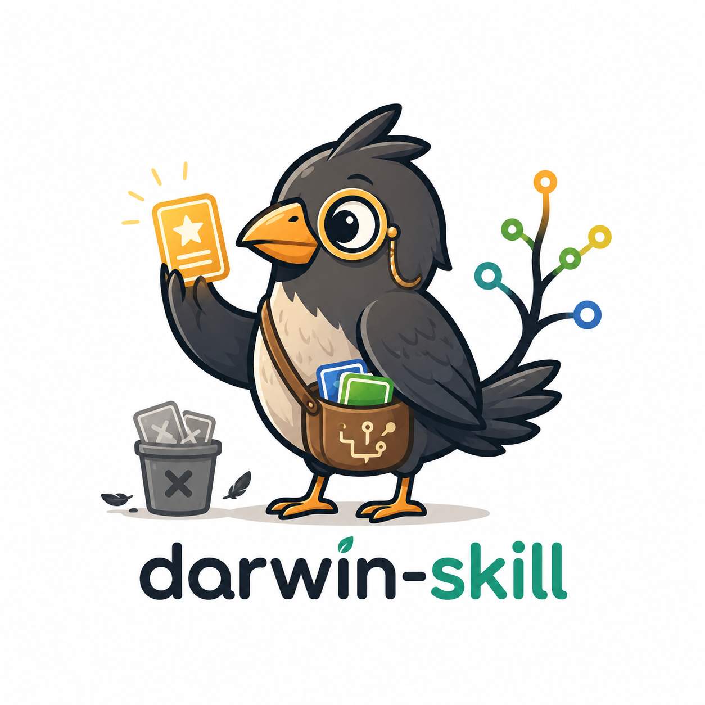

<p align="center">
  
</p>

<h1 align="center">达尔文.skill Pure</h1>

<p align="center">
  只带进化机制，不带作者个人物种库。把它交给你的 Agent，让它照料你自己的本机 skills 生态。
</p>

<p align="center">
  <strong>v1.0.0</strong> · Pure 纯净版
</p>

---

Pure 版只包含达尔文机制，不包含作者个人具体 skills。

## 用途

用智能体维护你自己的本机 skills / prompts / SOP 仓库，让有用的技能留下，重复的流程脚本化，过时的资产进入归档：

- 扫描资产
- 生成索引
- 判断哪些应该 skill 化
- 判断哪些应该脚本化
- 审查冗余与维护风险
- 归档低频或过时资产

## 使用

```bash
python3 scripts/scan_skills.py "/path/to/your/skills" --output registry/skills_index.json
```

在 Agent 中说：

> 读取我的本地 skills 仓库，并用达尔文机制管理、蒸馏、优化和归档 skills。

## 包含 Skills

- `darwin-skill-manager`
- `darwin-skill-distiller`
- `darwin-skill-auditor`
- `darwin-skill-archivist`
